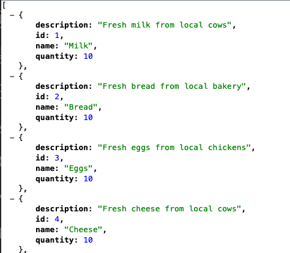
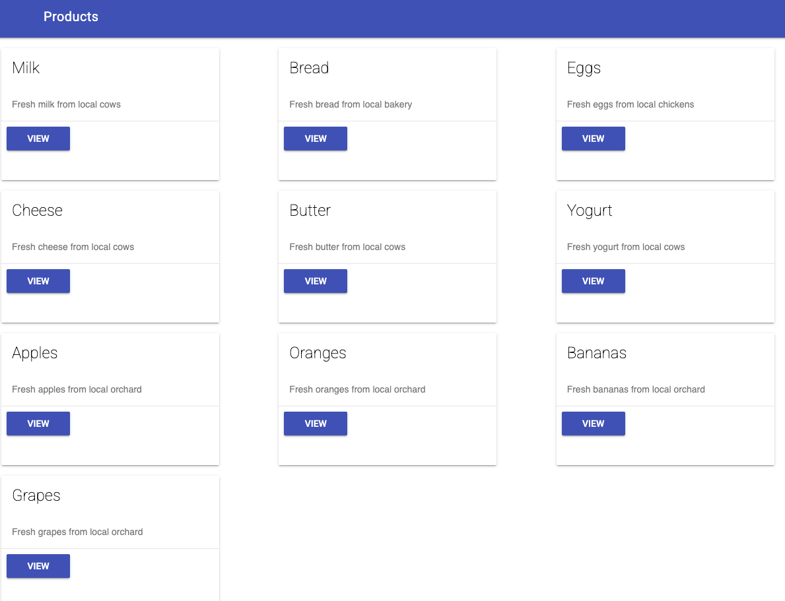

# Generate Code

It's time to see if Gemini can help us to add new functionality by generating
code.

## Create a new service

Create a `product_service.py` file and a new `ProductService` class:

```python
class ProductService:
```

Inside the class, add the following comment as a prompt to Gemini:

```python
# Create a _products variable with a list of 10 products for a supermarket
# Each product should have an id, name, description, and quantity
```

From the comment, Gemini Code Assist should generate some code (or you can
`Ctrl+Enter` to manually trigger it). You should see code similar to the
following:

```python
class ProductService:

    _products = [
        {
            "id": 1,
            "name": "Milk",
            "description": "Fresh milk from local cows",
            "quantity": 10
        },
        {
            "id": 2,
            "name": "Bread",
            "description": "Fresh bread from local bakery",
            "quantity": 10
        },
        {
            "id": 3,
            "name": "Eggs",
            "description": "Fresh eggs from local chickens",
            "quantity": 10
        },
        {
            "id": 4,
            "name": "Cheese",
            "description": "Fresh cheese from local cows",
            "quantity": 10
        },
        {
            "id": 5,
            "name": "Butter",
            "description": "Fresh butter from local cows",
            "quantity": 10
        },
        {
            "id": 6,
            "name": "Yogurt",
            "description": "Fresh yogurt from local cows",
            "quantity": 10
        },
        {
            "id": 7,
            "name": "Apples",
            "description": "Fresh apples from local orchard",
            "quantity": 10
        },
        {
            "id": 8,
            "name": "Oranges",
            "description": "Fresh oranges from local orchard",
            "quantity": 10
        },
        {
            "id": 9,
            "name": "Bananas",
            "description": "Fresh bananas from local orchard",
            "quantity": 10
        },
        {
            "id": 10,
            "name": "Grapes",
            "description": "Fresh grapes from local orchard",
            "quantity": 10
        }
    ]

    def get_products(self):
        return self._products

    def get_product(self, product_id):
        for product in self._products:
            if product["id"] == product_id:
                return product
```

That's pretty good! Next, let's add a route to this service from `app.py` file.

## Create a new route

Inside `app.py`, add the following code:

```python
@app.route('/products_json')
def products_json():
    """Return a raw JSON list of products using ProductService in product_service.py"""
```

At this point, Gemini will fill the rest and you should have something like
this:

```python
@app.route('/products_json')
def products_json():
    """Return a raw JSON list of products using ProductService in product_service.py"""
    from product_service import ProductService
    product_service = ProductService()
    return product_service.get_products()
```

Test the `/products_json` route, you should see a JSON list of products:



## Create a new template

Nice! Now, let's create a frontend for this new route. Create `products.html`
under `templates` folder.

Enter the following comment for Gemini:

```html
<!-- Create an HTML page that displays products from product_service.py using material
design. It should display each product name, description, and quantity in a card in a grid layout.
 -->
```

And this should generate some HTML:

```html
<!DOCTYPE html>
<html lang="en">
<head>
  <meta charset="UTF-8">
  <meta name="viewport" content="width=device-width, initial-scale=1.0">
  <title>Products</title>
  <link rel="stylesheet" href="https://fonts.googleapis.com/icon?family=Material+Icons">
  <link rel="stylesheet" href="https://code.getmdl.io/1.3.0/material.indigo-pink.min.css">
  <script defer src="https://code.getmdl.io/1.3.0/material.min.js"></script>
</head>
<body>
  <div class="mdl-layout mdl-js-layout mdl-layout--fixed-header">
    <header class="mdl-layout__header">
      <div class="mdl-layout__header-row">
        <!-- Title -->
        <span class="mdl-layout-title">Products</span>
      </div>
    </header>
    <main class="mdl-layout__content">
      <div class="page-content">
        <div class="mdl-grid">
          
          <div class="mdl-cell mdl-cell--4-col">
            <div class="mdl-card mdl-shadow--2dp">
              <div class="mdl-card__title">
                <h2 class="mdl-card__title-text">{{ product.name }}</h2>
              </div>
              <div class="mdl-card__supporting-text">
                {{ product.description }}
              </div>
              <div class="mdl-card__actions mdl-card--border">
                <a href="/products/{{ product.id }}" class="mdl-button mdl-button--primary mdl-js-button mdl-button--raised">
                  View
                </a>
              </div>
            </div>
          </div>
          
        </div>
      </div>
    </main>
  </div>
</body>
</html>
```

## Create another route

Go back to `app.py` to use the template. Inside `app.py`, create a
new route for the template:

```python
@app.route('/products_template/')
def products_template():
    """Return a template list of products using ProductService in product_service.py"""
```

Gemini should fill the rest:

```python
@app.route('/products_template/')
def products_template():
    """Return a template list of products using ProductService in product_service.py"""
    from product_service import ProductService
    product_service = ProductService()
    return render_template('products.html', products=product_service.get_products())
```

Test the `/products_template` route, you should see a basic frontend:



We create a new service with test data and a new template for it, all with the
help of Gemini. That's pretty cool!
